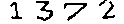

# This is the bmp preprocessing library.

## Methods
Use the traditional method to anti-noise of the captcha.
### Idea:
The noise is thinner than real numbers.
Spread the near colors.
### Impl.
Compile to a lib from C++.


## Usage:
Compile to your platform.
### CMAKE
This section will compile to a `demo` and a `libanti_noise.so`.
```
mkdir build
cd build
cmake ..
make
```
#### The `demo` usage:
```
./demo <source BMP> <dest.bmp>
```
Example:<br>
<br>
Output:<br>
<br>


### C++ demo
```
g++ lib/proc.cpp driver/cpp/main.cpp -std=c++17 -Ofast -o test.elf
./test.elf demo/1372.bmp
```

### Web asm
Use the [Web Assembly](https://webassembly.org/) here.<br>
If you want to compile webasm.js, you should install the `emcc` first by yourself.
And this is the [tutorial](https://developer.mozilla.org/en-US/docs/WebAssembly/C_to_wasm) of compiling.

**How to compile**
```
mkdir web_asm
cd web_asm/
emcc ../lib/proc.cpp -s WASM=1 -O3
```

### Python 
**For training.**<br>
Use the `cppyy` to include the `libanti_noise.so`.<br>

Example: The [driver/python/wrapper.py](driver/python/wrapper.py)<br>

#### Usage:
```
import wrapper
```